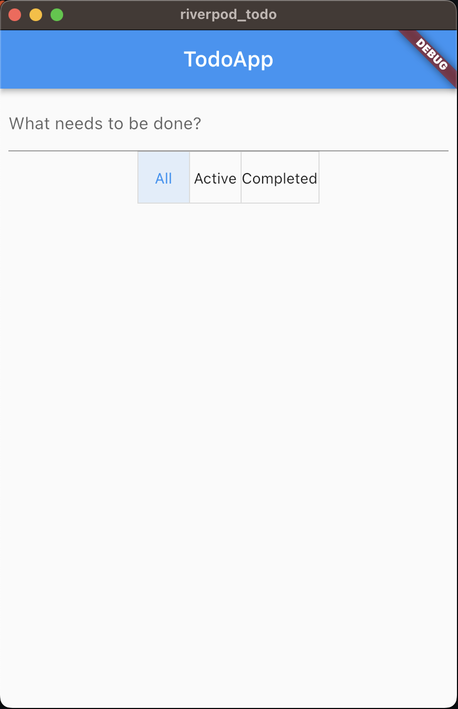

# riverpod_todo

A minimal example of the Todo App with RiverPod 2.0.

## Structure

* lib/main.dart: starting point.
* lib/todo_page.dart: main page of the app.
* lib/todo_list.dart: todo listing widget.
* lib/todo_text_field.dart: input text widget for adding a todo.
* lib/todo_provider.dart: business logic of the app with riverpod provider.
